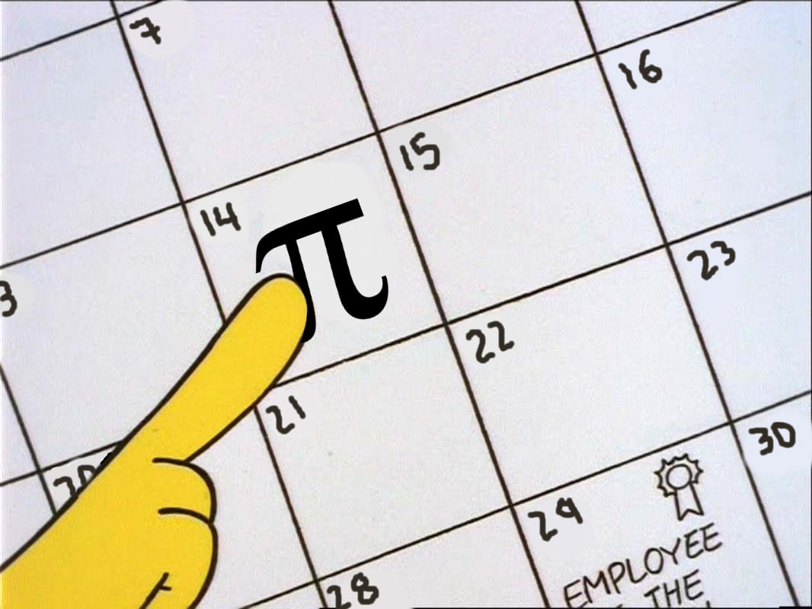

<p align="center">
  <a>
    
    <h1 align="center">PI and me</h1>
  </a>
</p>

<p align="center">
	<a href="https://github.com/manoloesparta/playlist.py/releases">
		
	</a>
  <a>
		
	</a>
  <a>
    
  </a>
</p>

> How much PI knows about you

A popular phrase said that inside of PI is everything that has happened, is happening and will happen. For example where you were and when you are going to die. But if you know a little about the properties of PI you can come to the conclusion that there is no pattern in the way of new decimals arrive, in a sort of way those digits are random.

What does this mean? First of all PI is irational meaning that there are infinite decimals, so if you have infinite numbers at a random order, chances are that everything real-world related is going to appear in PI. From there comes the inspiration for this little project.

This was created to celebrate the PI day, March 14. You can visit it right [here](pending_url).

## What this does?

You give it some input (a numerical input), for example your phone number, and searches it in the first billion digits of PI. If it doesn't find it complete, it will pop the last digit until it found one coincidence.

## Where did you get the digits?

Believe or not, it is hard to download more than 1 million digits of PI, so you can see in the root directory a file named *collect.py* that connects to an API so it can download the first billion digits.

## Requirements to Run Locally
```
Go 1.13
Python 3.7
```

## Local Build
> Note that the download will take way longer than usual because the size of the billion digits is around 1GB
```bash
git clone https://github.com/maybemanolo/pi
cd api
go run main.go
cd ../client
open index.html
```

## Contributing
Pull requests are welcome. For major changes, please open an issue first to discuss what you would like to change.

## License
This project is licensed under the MIT License
